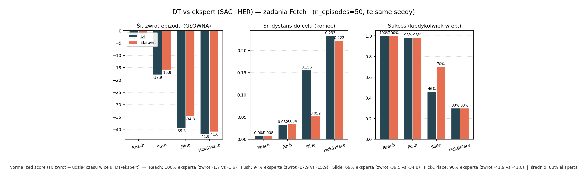

# Sprawozdanie — L6: Decision Transformer na zadaniach Fetch (offline RL)

## 1. Cel i temat zadania

Celem zadania było zbudowanie pełnego pipeline'u **offline RL** opartego o **Decision Transformer (DT)**
i sprawdzenie, jak radzi sobie on na rodzinie zadań manipulacyjnych **Fetch** (robotyczne ramię,
obserwacja typu `Dict`, **nagroda rzadka**, cel zadawany jako `desired_goal`).

Rozważane środowiska (Gymnasium / Gymnasium-Robotics, wersja **v4**):

- **FetchReach-v4** — dosięgnięcie zadanej pozycji (najłatwiejsze),
- **FetchPush-v4** — przepchnięcie obiektu do celu,
- **FetchSlide-v4** — wślizgnięcie krążka po stole do celu (najtrudniejsze, dynamika tarcia),
- **FetchPickAndPlace-v4** — chwyt i przeniesienie obiektu.

Główna idea Decision Transformera: zamiast uczyć politykę przez maksymalizację nagrody (online RL),
traktujemy uczenie jak **sekwencyjne modelowanie** — model dostaje sekwencję
`(return-to-go, stan, akcja, return-to-go, stan, akcja, …)` i przewiduje kolejną akcję. W ewaluacji
warunkujemy go na **wysoki zadany zwrot (RTG)** i sprawdzamy, czy potrafi go zrealizować.

Cały pipeline składa się z czterech etapów: **(1) trening ekspertów → (2) nagranie ich śladów do
Minari → (3) trening DT na danych offline → (4) ewaluacja online DT vs baseline (ekspert)**.

Szczegóły uruchomieniowe, instalacja zależności i opis flag CLI znajdują się w
[`README.md`](README.md). Tutaj opisujemy przebieg eksperymentu i wyniki.

---

## 2. Etap 1 — trening ekspertów

Eksperci dostarczają dane treningowe dla DT, więc ich jakość jest kluczowa.

- **Algorytm główny: SAC + HER** ([`train_expert_sac_her_fetch.py`](train_expert_sac_her_fetch.py)).
  Na zadaniach Fetch z nagrodą rzadką **Hindsight Experience Replay** jest praktycznie konieczne —
  bez niego agent prawie nigdy nie trafia w cel i nie ma z czego się uczyć. Użyto `SAC`
  z `HerReplayBuffer` i `MultiInputPolicy` (obsługa obserwacji `Dict`).
- **Algorytm pomocniczy: PPO** ([`train_expert_ppo.py`](train_expert_ppo.py)) — testowany, ale na
  rzadkiej nagrodzie Fetch wypada wyraźnie słabiej niż SAC+HER, więc do nagrywania danych użyto SAC.
- **Wczesny stop (streak) i certyfikacja jakości**: trening kończy się po osiągnięciu progu sukcesu
  (per env, np. Reach 0.95, Push 0.85) przez **K kolejnych** ewaluacji z rzędu. Stan jakości zapisywany
  jest w `quality_metadata.json`, dzięki czemu kolejne joby na klastrze potrafią **pominąć** już
  scertyfikowane środowisko (`[skip]`) albo **wznowić** trening (`[reconcile]`).
- **Organizacja wag**: katalog akumulacyjny `weights/besties/<env>/` z `best/`, `checkpoints/`,
  `latest/` i `manifest.json`. Końcowe modele 4 zadań: `weights/besties/<env>/sac_her_model.zip`.

Eksperci dla wszystkich czterech środowisk zostali wytrenowani i scertyfikowani
(`weights/besties/manifest_suite.json`).

---

## 3. Etap 2 — nagranie śladów eksperta do Minari

Skrypt [`record_expert_minari.py`](record_expert_minari.py) ładuje checkpoint SAC, odtwarza rollouty
w środowisku owiniętym w **`minari.DataCollector`** i na końcu woła `create_dataset`, zapisując dane
w formacie **HDF5** do `l6/minari_datasets/` (dataset-id schematu `l6/<env-slug>/expert-sac-v0`).

Istotne szczegóły techniczne, które trzeba było obsłużyć:

- **`SAC.load` wymaga środowiska** (przez `HerReplayBuffer`), więc `--env-id` musi być zgodny z tym,
  na którym trenowano dany model.
- **Spójność `info` w epizodzie** — Minari łączy `info` przez `jax.tree_map`, więc wszystkie kroki
  muszą mieć te same klucze. Fetch zwraca `is_success` dopiero w `step()` (puste w `reset()`), dlatego
  użyto wrappera `_MinariGoalInfoPadWrapper`, który dopina brakujące `is_success`.
- **Liczba epizodów**: nagrano po **1800 epizodów** na środowisko (kompromis między pokryciem danych a
  rozmiarem HDF5 i czasem nagrywania).

---

## 4. Etap 3 — trening Decision Transformera (nanoDT)

Skrypt [`train_dt_minari_fetch.py`](train_dt_minari_fetch.py) (oraz wsadowo
[`train_dt_minari_multi.py`](train_dt_minari_multi.py)):

- ładuje lokalny dataset Minari i **spłaszcza obserwację `Dict` → wektor** w ustalonej kolejności
  kluczy (`achieved_goal`, `desired_goal`, `observation` — alfabetycznie, zapisanej w manifeście),
- trenuje **nanoDT** (`NanoDTAgent`), zapisując wagi i manifest w `dt_weights/<timestamp>/`.

Konieczny był **patch pętli treningowej** ([`nanodt_train_loop.py`](nanodt_train_loop.py)):
`itertools.cycle(iter(DataLoader))` oraz `num_workers=0` na Windows — upstreamowy nanoDT 0.1.0 potrafił
rzucać `StopIteration` przy krótkich runach / ewaluacji. Dołożono też opcjonalny **early stopping**
(plateau / próg loss / online success) oraz **checkpointy pośrednie** (`ckpt_iter_*.pth`).

---

## 5. Etap 4 — ewaluacja DT vs baseline (ekspert)

[`eval_dt_minari_fetch.py`](eval_dt_minari_fetch.py) robi rollout DT (z poprawnym warunkowaniem na RTG)
i porównuje go z **baselinem = ekspertem SAC**, który zebrał dane. Metryki trafiają do
`eval_metrics.json`, a [`plot_dt_vs_expert_suite.py`](plot_dt_vs_expert_suite.py) rysuje zbiorczy wykres.
Porównujemy m.in.: średni zwrot epizodu, średni dystans do celu na końcu epizodu i **success rate**
(odsetek epizodów zakończonych sukcesem), zawsze na tych samych ziarnach i `n_episodes`.

---

## 6. Wyniki — dotychczasowe (gorsze)

### 6.1. Pierwsze podejście — DT praktycznie nie działał

Najwcześniejszy run (`dt_eval_runs/2026-05-31_19-19/`, FetchReach, 20 epizodów, **bez** baseline) dał
wynik zerowy — DT nie realizował zadania:

| Metryka | DT (pierwsza próba) |
|---|---|
| `success_rate_final` | **0.00** |
| `success_rate_any` | 0.05 |
| `mean_return` | −49.6 |
| `mean_final_goal_dist` | 0.129 |

Czyli na **najłatwiejszym** zadaniu (Reach), na którym ekspert ma 100% sukcesu, DT nie trafiał w cel
niemal nigdy. Przyczyny: zbyt mało danych offline i/lub zbyt mało iteracji treningu DT oraz dopracowanie
spłaszczania obserwacji i warunkowania na RTG. Po naprawieniu pipeline'u (więcej epizodów: 1800, więcej
iteracji, spójne klucze obserwacji) wyniki diametralnie się poprawiły — patrz niżej.

### 6.2. Pełny suite — DT dorównuje, ale **nie przebija** eksperta

Po poprawkach przepuszczono wszystkie 4 zadania (`dt_eval_runs/suite_*`, **50 epizodów**, te same ziarna,
baseline = ekspert SAC, który zebrał dane). Wyniki zbiorcze:

| Zadanie | Success DT | Success ekspert | Śr. zwrot DT | Śr. zwrot ekspert | % zwrotu eksperta |
|---|---|---|---|---|---|
| FetchReach-v4 | **1.00** | 1.00 | −1.72 | −1.62 | 100% |
| FetchPush-v4 | 0.90 | 0.92 | −17.88 | −15.92 | 94% |
| FetchSlide-v4 | **0.36** | 0.56 | −39.54 | −34.78 | 69% |
| FetchPickAndPlace-v4 | 0.26 | 0.22 | −41.94 | −41.02 | 90% |
| **średnio** | | | | | **~88%** |

**Interpretacja:**

- Na **Reach** DT jest nieodróżnialny od eksperta (100% sukcesu) — zadanie łatwe, dane gęsto pokrywają
  przestrzeń.
- Na **Push** DT jest minimalnie gorszy (90% vs 92%), praktycznie remis.
- Na **Slide** jest **wyraźnie gorszy** (36% vs 56%) — to najtrudniejsze zadanie (dynamika ślizgu,
  trudniejsze do imitacji z danych offline).
- Na **PickAndPlace** obie polityki są słabe (~25%); DT nieznacznie wyprzedza eksperta, ale przy tak
  niskim sukcesie różnica jest w granicach szumu.

**Wniosek ogólny:** DT uczony imitacyjnie z danych eksperta osiąga średnio **~88% jego performansu**
i go **nie przebija**. Jest to oczekiwane — DT warunkowany na zwrot uczy się odtwarzać zachowania
obecne w danych, a górną granicą jakości jest tu polityka, która te dane wygenerowała (behavior policy).
Stąd zadane niżej pytanie badawcze.

---

## 7. Etap 5 — nowy eksperyment (wyniki jeszcze niedostępne)

Skoro DT na danych „idealnego” eksperta nie przebija behavior policy, postawiono klasyczne pytanie z
literatury offline RL o **stitching / improvement over behavior policy**:

> Czy DT warunkowany na **wysoki RTG**, uczony na śladach **niedorobionego** eksperta (checkpoint
> ~3/4 drogi, ok. 75% maks. performansu), potrafi **przebić** politykę, która zebrała te (gorsze) dane?

Realizuje to pipeline [`run_ckpt_pipeline.py`](run_ckpt_pipeline.py) (record → train → eval → plot)
dla jednego środowiska na proces (osobne joby SLURM na Cyfronecie). Dane eksperta końcowego **nie są
nadpisywane** — dataset-id i katalogi DT/eval mają sufiks z liczbą kroków checkpointu.

Uruchomione joby (checkpointy dobrane tak, by ekspert był „niedorobiony”):

| Zadanie | Checkpoint (kroki SAC) | Job |
|---|---|---|
| FetchSlide-v4 | 800 000 | `latest_job_slide` |
| FetchPush-v4 | 300 000 | `latest_job_push` |
| FetchPickAndPlace-v4 | 400 000 | `latest_job_pnp` |

Status w chwili pisania: joby liczą się na GPU (NVIDIA, CUDA 12.2), powstają checkpointy DT
(`dt_weights_ckpt/<env>-ckpt<steps>/ckpt_iter_*.pth`). **Wyniki ewaluacji nie są jeszcze gotowe.**

### 7.1. Wyniki (DO UZUPEŁNIENIA)

Pytanie kluczowe: **`Success DT` vs `Success ckpt-eksperta`** — jeśli DT > behavior policy, mamy dowód
na poprawę ponad politykę zbierającą dane.

| Zadanie | Ckpt (kroki) | Success DT | Success ckpt-ekspert | Śr. zwrot DT | Śr. zwrot ckpt-ekspert | DT przebija? |
|---|---|---|---|---|---|---|
| FetchSlide-v4 | 800 000 | _(TBD)_ | _(TBD)_ | _(TBD)_ | _(TBD)_ | _(TBD)_ |
| FetchPush-v4 | 300 000 | _(TBD)_ | _(TBD)_ | _(TBD)_ | _(TBD)_ | _(TBD)_ |
| FetchPickAndPlace-v4 | 400 000 | _(TBD)_ | _(TBD)_ | _(TBD)_ | _(TBD)_ | _(TBD)_ |

> _Miejsce na wykres porównawczy ckpt-ekspert vs DT (do wygenerowania przez `plot_dt_vs_baseline.py`
> / `plot_dt_vs_expert_suite.py` po zakończeniu jobów)._

### 7.2. Wnioski z nowego eksperymentu (DO UZUPEŁNIENIA)

_(Tu trafi interpretacja: czy i na których zadaniach DT przebił niedorobionego eksperta, oraz
porównanie z sekcją 6 — czy „gorsze” dane paradoksalnie pozwoliły DT na większy zysk względem behavior
policy.)_

---

## 8. Podsumowanie

- Zbudowano kompletny pipeline offline RL: **SAC+HER (ekspert) → Minari (dane) → nanoDT → ewaluacja vs
  baseline**, działający dla 4 zadań Fetch.
- Po naprawieniu wczesnych problemów (zerowy sukces DT na pierwszym podejściu) DT osiąga **~88%
  performansu eksperta** średnio, ale go **nie przebija** — co jest spójne z teorią (górna granica =
  behavior policy przy danych z „idealnego” eksperta).
- W toku jest eksperyment sprawdzający **improvement over behavior policy** na danych z niedorobionego
  eksperta (checkpoint ~75%) — wyniki czekają na uzupełnienie (sekcja 7).
